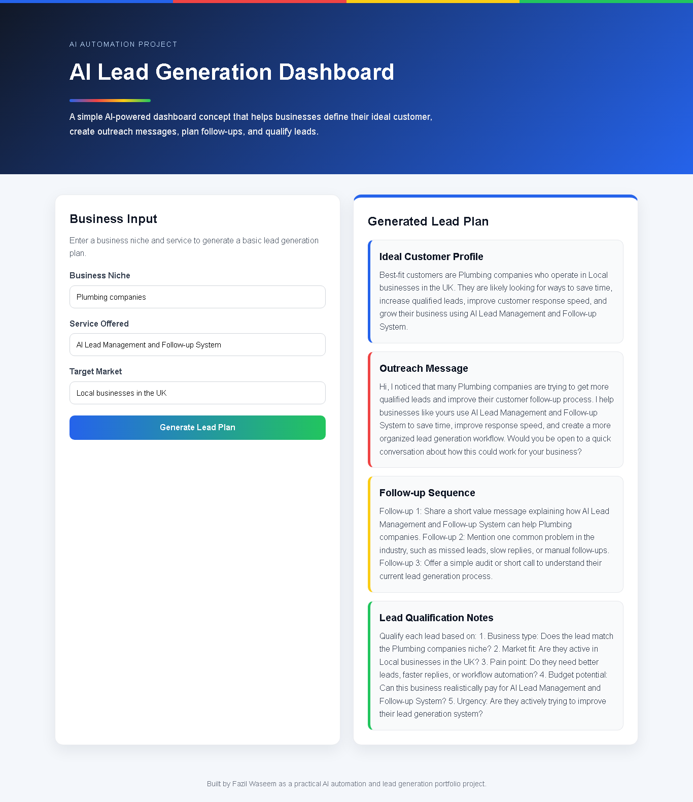

# AI Lead Generation Dashboard

A practical AI-powered lead generation dashboard concept that helps businesses create ideal customer profiles, outreach messages, follow-up sequences, and lead qualification notes.

## Live Demo

https://fazilprojects.github.io/ai-lead-generation-dashboard/

## Screenshot

## Project Overview

This project was built as part of my AI automation and lead generation portfolio. The goal was to create a simple but useful dashboard that shows how AI-style workflows can help businesses plan outreach and qualify leads.

The dashboard takes three inputs:

* Business niche
* Service offered
* Target market

Based on these inputs, it generates:

* Ideal customer profile
* Outreach message
* Follow-up sequence
* Lead qualification notes

## Features

* Clean and responsive dashboard layout
* Business niche input form
* Automated customer profile generation
* Outreach message generator
* Follow-up sequence generator
* Lead qualification notes
* Mobile-friendly design
* Live deployment using GitHub Pages

## Tech Stack

* HTML
* CSS
* JavaScript
* GitHub Pages

## Example Use Case

A business offering an AI lead management and follow-up system to plumbing companies can use this dashboard to quickly create a basic lead generation plan.

Example input:

* Business niche: Plumbing companies
* Service offered: AI Lead Management and Follow-up System
* Target market: Local businesses in the UK

The dashboard then creates a simple outreach strategy and lead qualification notes.

## What I Learned

Through this project, I practiced:

* Structuring a frontend project
* Creating a clean dashboard UI
* Writing JavaScript logic for dynamic outputs
* Building a project that solves a real business problem
* Deploying a live project using GitHub Pages
* Documenting a project professionally for a portfolio

## Future Improvements

* Add copy-to-clipboard buttons
* Add lead score calculation
* Add downloadable CSV export
* Add saved lead plans using local storage
* Add AI API integration in the future
* Add more industries and outreach templates
* Improve brand consistency across future dashboard components

## Author

Built by Fazil Waseem as a practical AI automation and lead generation portfolio project.
